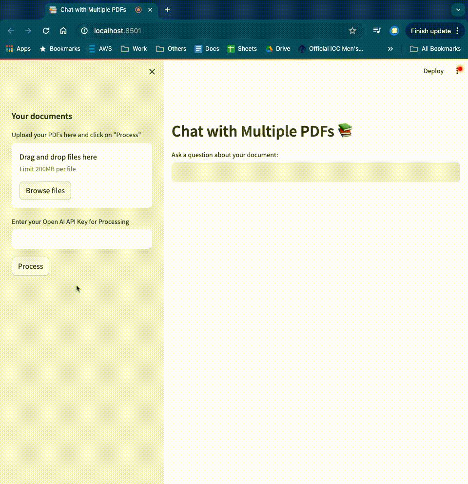

## Chat with your pdf documents  

Upload your pdf file and ask the chatbot questions on the document. No data is persisted on the server. Your data is lost when you close the browser window.  

You can also run this project by running it on your machine  
* `python3 - m venv my-env`  
* `source my-env/bin/activate`  
* `streamlit run app.py`  
* Follow the screencast to run the app  
  

Navigate to this free hosted page, and try the application with your api keys  

Enjoy
